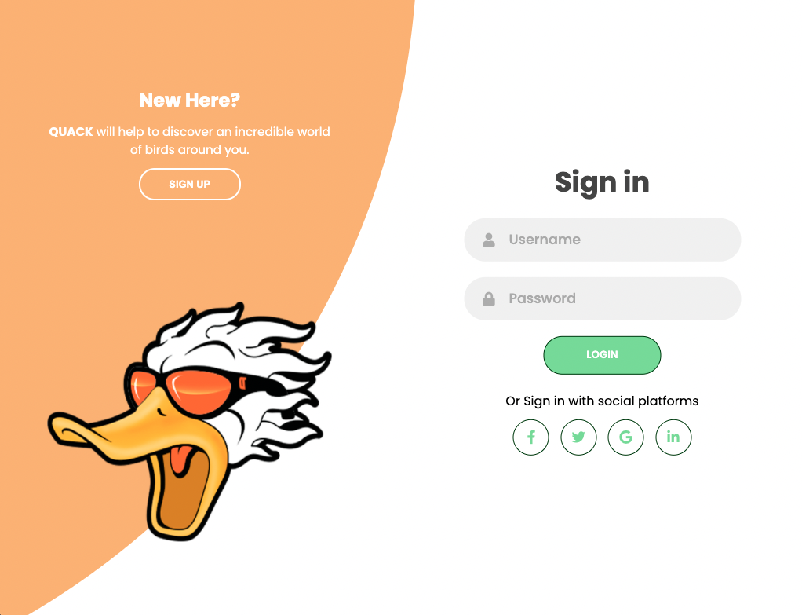

# Birdwatcher

## Table of contents
 * [General info](#General-Info)
 * [Specifics](#Specifics)
 * [Deployment of application](#Deployment-of-application)
 * [Application Code](#Application-Code)
 * [Screenshots](#Screenshots)
 * [Comments](#Comments)

 # General Info

 # Specifics

 # Deployment of application

   To run a project, please follow the link 

   [Heroku](https://birdwatcherquack.herokuapp.com/)

 # Application Code

   To view application code, please follow the link 

   [GitHub](https://github.com/BirdWatcherQuack/BirdWatcher)

 # Screenshots

  Login/Sign up page

   

 # Comments