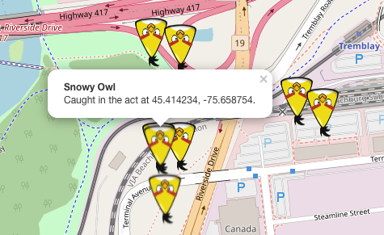
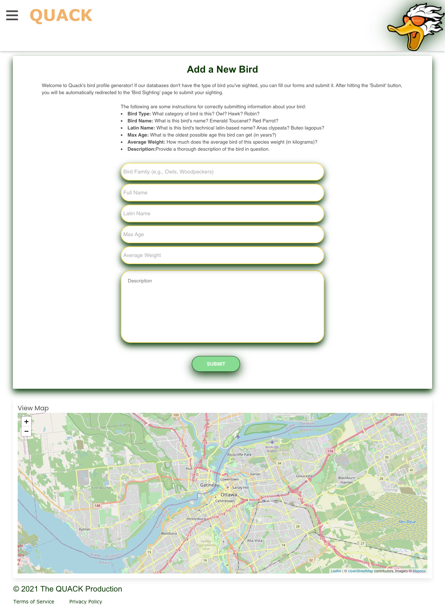
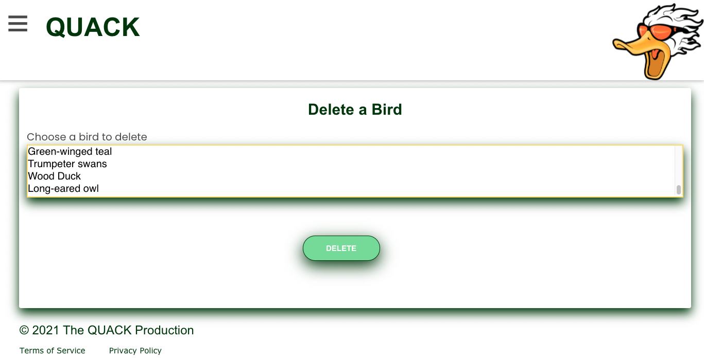

# Birdwatcher (Quack) Application

## Table of contents
 * [Overview](#Overview)
 * [Features](#Features)
 * [Deployment of application](#Deployment-of-application)
 * [Application Code](#Application-Code)
 * [Screenshots](#Screenshots)
 * [Future Developments](#Future-Developments)
 * [License](#License)
 * [Creators and Collaborators](#Creators-and-Collaborators)

# Overview
 Quack is a birdwatcher application which allows for users to view bird sightings (submitted by others) in an interactive map. Users can submit their own bird sightings; they can also learn more about individual birds by clicking on its respective HTML cards.

 This application is centered around the Ottawa area, though users can still technically submit bird sightings from anywhere in the world.

# Features

  * Entering the application:
     * To enter the Quack website and view its contents, prospective users must either sign up or log in. Quack will confirm if the username and password match its database, as well as verify that the username doesn't already exist.
     * For security purposes, the password must have a minimum of 6 and a maximum of 20 characters; the password must also conform to additional measures, such as the use of special and uppercase characters.  
     * A successful login redirects the user to the homepage.

  * Homepage:
     * The user is presented random HTML `cards` containing images of birds commonly found in the Ottawa area.
     * Hovering over the card with the mouse displays the name of the bird associated with the image, as well as a `Learn More` feature allowing you to view more details about the bird in question. This feature applies to all bird cards.
     * At the bottom of the random selection of birds, there is a `View All Birds` link to see the complete list of pre-submitted birds, arranged alphabetically. This option is also available in the navigation bar.
     * Also, there is a `Shuffle` link, that helps to refresh page in order to see other 8 random birds.
     * The navigation bar allows users to quickly find features which allow them to submit bird sightings, view specifics about a particular bird, or submit a new bird profile.
     * The homepage includes a map containing bird markers; they represent bird sightings, corresponding to the birds from the (above) cards. They are selected randomly from the database, meaning that these markers will naturally be different each time the page loads!

  * Add Sighting
     * To add a bird sighting, the user clicks on the `View Map` link - located close to the map - or by clicking the `Add Sighting` in the navigation bar.
     * The `/map` route brings you to a large map with two inputs above it. From there, our user enters two pieces of information:
      - The bird you saw; this is an autocomplete list, coming directly from the database, and
      - The map coordinates (where you saw the bird); clicking on the map populates this input with its respective coordinates.
     * You can submit your bird sighting to the database by pressing the `Submit Bird Sighting For` button.
     * After submitting, the application redirects you to a `/singlebird:id` page which corresponds to the id of the bird you've submitted. (You don't have to worry about this; our code handles that!)
  
  * View Individual Birds
    * From the homepage, if you click for more information about a bird, or from `/map` after submitting a bird, you are brought to a `/singlebird` route, which presents you more specific information about your bird of choice, including its technical Latin name, its top age and weight, and a detailed description.

  * Creating a New Bird Profile      
    * The Quack application comes pre-loaded with 20 unique bird profiles. By clicking the `Add New Bird` link in the navigation bar, users can create and submit a “new" bird profile, including details such as its proper name, its age, weight, and description. 
    * Upon submission, users are redirected to the `Submit Sighting` page, in which their bird appears as a searchable option. 

  * Deleting a Bird Profile
    * Given that a bird might have been added mistakenly or in bad faith, Quack's developers are able to delete bird profiles by accessing a secret URL and entering their choice of bird in an interactive menu.

  * Logging Out
    * At any time, the user can log out from the application by clicking “Logout” inside the navigation bar. The session terminates and the user is redirected to the sign in/sign up page. Our application also contains `Terms of Service`, and a `Privacy Policy` for security purposes.

 # Deployment of application

   To run the application, [click this link to be taken to the Heroku app.](https://birdwatcherquack.herokuapp.com/)

 # Application Code

   To view application code, [click this link to be taken to the Git repository.](https://github.com/BirdWatcherQuack/BirdWatcher)

 # Screenshots
 ### Login/Sign up page

  ### Side bar that displays username of logged-in user

  ### Home page with location markers (based on birds in above cards)

  ### Single bird description

  ### Form to submit a sighting for a bird

 ### Markers on the map

 ### Form to submit new bird
   

### Delete bird (only available for developers)

 # Future Developments

The Quack application has a number of features, allowing you to add and view birds and bird sightings. However, many extra features could be added to make Quack website more interactive. Here are a few ways we can improve our applications going forward.

 * There are no means to retrieve a forgotten password (i.e., the `Forgot Your Password?` prompt found under most logins). Our login page has such a prompt, which takes you to a form. However, submitting this form does not accomplish a password retrieval. Going forward, we plan on allowing users to update their passwords.

 * As it stands, we have the limited ability to sign up or log in using a Facebook account. We would further refine this process.

 * The login/signup page contains icons which allow a user to register through Twitter, Google, or LinkedIn. These currently do not work, but we can later link Quack with these social media accounts in the future, among others.

 * Furthermore, we would like to create user-specific account information, in which they may view birds they have added.
 
 * In addition to the existing bird profile generator, we might allow users to submit personal images of the birds they've seen. This would require a performant server, as large numbers of images would otherwise slow down the operation of our website.

 * To prevent a user from overflowing the map with markers (in bad faith), we plan on setting up restrictions (e.g., one bird sighting submission per 30 seconds). Moreover, we would create an approval process, for administrators to review and approve the bird sighting/profile before it appears on the website for all to view. These measures would limit false information.

## License
This project is licensed under:

### MIT License 

## Creators and Collaborators

* Fabio Miguel Amorim Rodrigues 
* Nwakaego Gift Eze
* Ahmed Hakeem
* Anastasia Sorkin
* Daniel Pisani