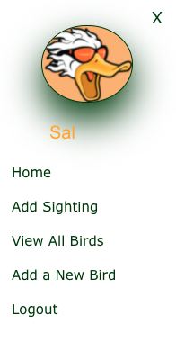

# Birdwatcher

## Table of contents
 * [General info](#General-Info)
 * [Specifics](#Specifics)
 * [Deployment of application](#Deployment-of-application)
 * [Application Code](#Application-Code)
 * [Screenshots](#Screenshots)
 * [Comments](#Comments)

# General Info

 Quack is a birdwatcher application that allows user to submit sighting in Ottawa area.

# Specifics

  * Entering website:
     * in order to enter Quack website and view any information user has to sign up or log in if already has username and password. 
     * after successfully providing information, user will be redirected to homepage.

  * Homepage:
     * user will be presented with randomly selected cards containing image of the bird that you can find in Ottawa area.
     * when the user focuses on the card with the mouse, it shows the bird name associated with the image.
     * there is an option to view more details about every single bird
     * user also can click “View All Birds” in order to see the complete list of the birds
     * by clicking on navigation bar, user can choose which page he/she/they would like to view at the moment.
     * homepage includes a map, where the user can view location of the registered birds based on the birds’ cards presenting on the homepage at the moment.

  * Add Sighting
     * in order to add sighting user should click on “View Map” on the map, or click “Add Sighting” in navigation bar
     * two inputs let user to choose bird from the list and put marker on by clicking on the map
     * after user can press “Submit Bird Sighting For” button to add location for the bird 

  At any time, user can log out from the page by clicking “Logout” on navigation bar. The session will be over and the user will be redirected to sign in/sign up page. Application has “Terms of Service”, and “Privacy Policy” for security purposes.

 # Deployment of application

   To run a project, please follow the link 

   [Heroku](https://birdwatcherquack.herokuapp.com/)

 # Application Code

   To view application code, please follow the link 

   [GitHub](https://github.com/BirdWatcherQuack/BirdWatcher)

 # Screenshots

  Login/Sign up page

   

  Side bar that displays username of logeded in user

   

  Home page with location markers based on the displayed birds

   

  Single bird descroption

  

  Form to submit sighting for a bird

   

   Form to submit new bird

   

 # Comments

 * User can sign up using Facebook account, however, log out process should be included, specific for Facebook logout requirements. 

 * The login/signup page has icons to sign up with Twitter, Google, and LinkedIn. They don’t work but social media accounts can be linked in the future, as well as different options of social media types can be added.

 * Since user should provide some personal information, we are planning to make the requirements for password stricter, for better security purposes.

 * Also, we would like to create account information for users, where after entering the website, they can view what birds they added, and the option to create “new bird”. User will be able to different names that are not in the list, as well as add personal image. We would be using different server, since big number of images will slow down operation of our website.

 * In order to prevent overflow of markers, we will set up restrictions (ex.: one bird per 30sec). Moreover, we would like to be able to approve submitting before it appears for the rest of users to view, to limit falsie information (ex. saves as commented out data)

 Many extra features can be added to make Quack website more interactive.
